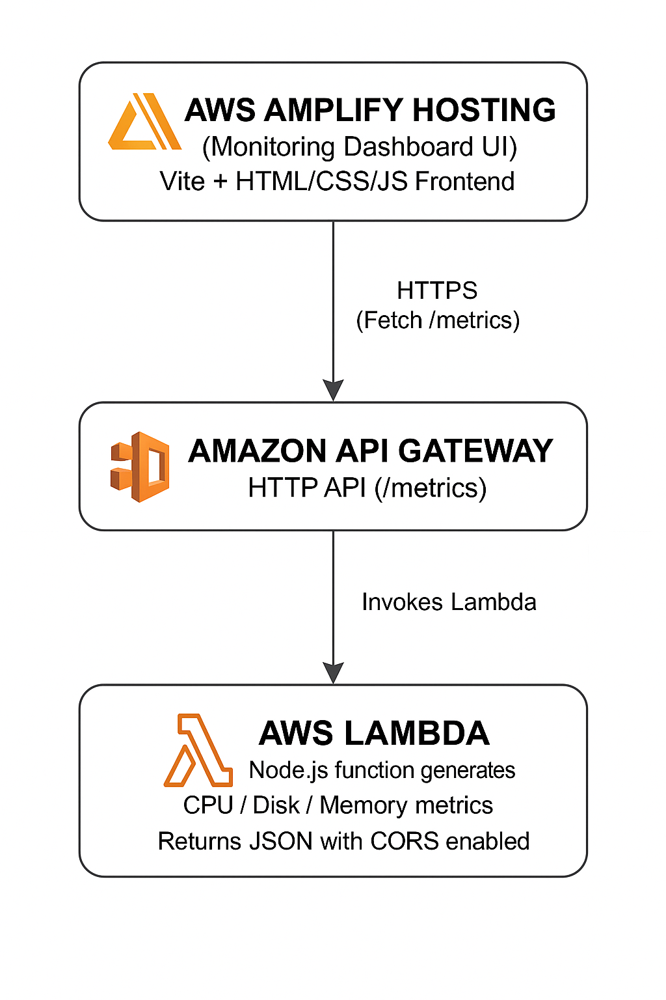

# **InfraWatch - Cloud Resource Monitoring Dashboard**

A fully serverless cloud monitoring dashboard that displays real-time system metrics (CPU, Disk, Memory) fetched from an AWS Lambda API and rendered through a Vite-powered frontend hosted on AWS Amplify.
Built for cloud/DevOps learning and demonstration purposes.

---

## Live Demo

https://main.d31cqcsishko0l.amplifyapp.com

## Project Structure

---

## Tech Used

- **Frontend: Vite, HTML, CSS, JavaScript**
- **Hosting: AWS Amplify**
- **Backend: AWS Lambda (Node.js 18), API Gateway (HTTP API), CORS enabled**
- **Architecture: Fully serverless, real-time metric polling**

---
